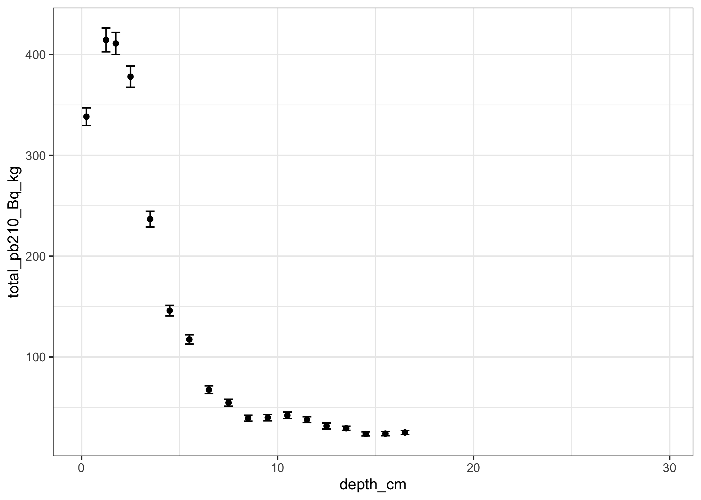
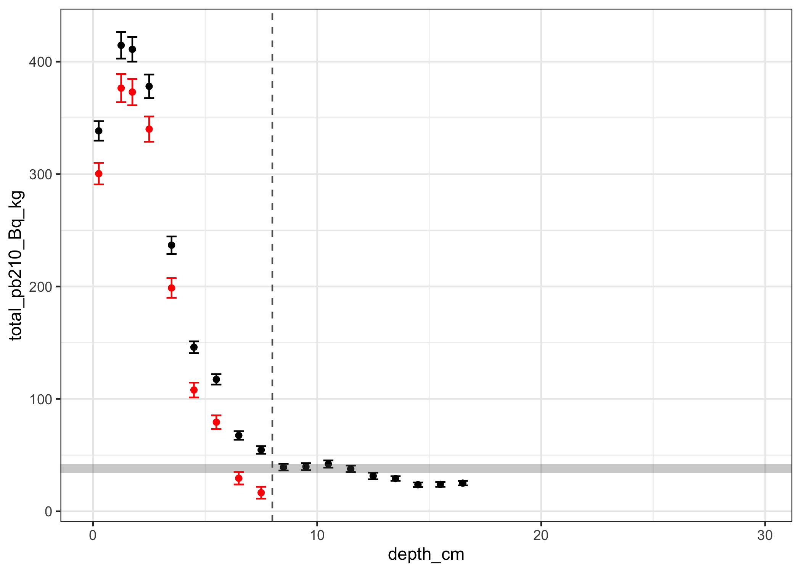

<!-- README.md is generated from README.Rmd. Please edit that file -->

# pb210

[](https://travis-ci.org/paleolimbot/pb210)
[](https://codecov.io/github/paleolimbot/pb210?branch=master)
[](https://www.tidyverse.org/lifecycle/#experimental)

The goal of pb210 is to provide a reproducible R-based workflow to
create sediment core chronologies from <sup>210</sup>Pb activity
measurements. I am not an expert on <sup>210</sup>Pb, but occasionally
need to interpret these data and would love input on how to make this
package better (open an issue on the issues page or email me\!).

This is currently in experimental mode and under heavy development, so
use it with caution\!

## Installation

You can install the development version of *pb210* from github with:

``` r
# install.package("remotes")
remotes::install_github("paleolimbot/pb210")
```

If you can load the package, it’s installed\!

``` r
library(pb210)
```

## Example

You have some lead-210 measurements, but you want dates\! Included are
some lead-210 measurements from [Alta Lake, Whistler, British
Columbia](http://doi.org/10.1007/s10933-016-9919-x).



First, you have to decide where “background” is. For these data, one
might choose 7 cm (there is a facies change at 11 cm that is likely
responsible for the further drop in activity). Then, you have to decide
*what* background is. One method is to take the mean and standard
deviation of the background data (another common method is to use
measurements of <sup>226</sup>Ra activity).

``` r
alta_lake_background <- alta_lake_pb210 %>%
  filter(depth_cm > 8) %>%
  summarise(
    background = mean(total_pb210_Bq_kg, na.rm = TRUE),
    background_sd = sd(total_pb210_Bq_kg, na.rm = TRUE)
  )

alta_lake_background
#> # A tibble: 1 x 2
#>   background background_sd
#>        <dbl>         <dbl>
#> 1       32.5          7.38
```


Next, we need to remove the “background” from the total measurements,
propogating error on the way through. The **pb210** package uses the
[errors package](https://cran.r-project.org/package=errors) to do most
of the error propogation. This measure is called the *excess* or
*unsupported* specific activity. The `pb210_excess()` function is one
way to do this.

``` r
alta_lake_pb210$excess_pb210 <- pb210_excess(
  set_errors(alta_lake_pb210$total_pb210_Bq_kg, alta_lake_pb210$total_pb210_sd),
  set_errors(alta_lake_background$background, alta_lake_background$background_sd)
)

alta_lake_pb210$excess_pb210[alta_lake_pb210$depth_cm > 8] <- NA
```



For the constant rate of supply model (CRS; the most widely used model),
we also need to calculate the *inventory*, or the cumulative activity of
lead-210 starting at the bottom of the core. There are as many ways to
do this as there are paleolimnologists, but the `pb210_inventory()`
function should get you started. Note that this function requires the
cumulative dry mass in kilograms as an input (as do the other dating
functions).

``` r
alta_lake_pb210$cumulative_dry_mass <- pb210_cumulative_mass(alta_lake_pb210$slice_mass_g / 1000)
alta_lake_pb210$inventory <- pb210_inventory(
  alta_lake_pb210$cumulative_dry_mass,
  alta_lake_pb210$excess_pb210,
  model_bottom = 0
)
```


Here I told it to ignore the possibility that there was any excess
lead-210 inventory in the core before the last known measurement…in
reality, this should be considered (you can consider it yourself by
creating an exponential model with `pb210_fit_exponential()` and passing
it to `model_bottom`).

Now that we have all the parts, we can calculate the ages\!

``` r
crs_ages <- pb210_crs(
  alta_lake_pb210$cumulative_dry_mass,
  alta_lake_pb210$excess_pb210,
  inventory = alta_lake_pb210$inventory
) %>%
  predict()

alta_lake_pb210 %>%
  bind_cols(crs_ages) %>%
  select(cumulative_dry_mass, age, age_sd)
#> # A tibble: 32 x 3
#>    cumulative_dry_mass    age age_sd
#>                  <dbl>  <dbl>  <dbl>
#>  1             0.00132   4.60   1.81
#>  2             0.00343   7.44  NA   
#>  3             0.00581  11.0    1.78
#>  4             0.00815  15.3    1.72
#>  5             0.0139   28.4    1.82
#>  6             0.0197   44.4    2.50
#>  7             0.0268   64.1    3.72
#>  8             0.0336   86.1    4.76
#>  9             0.0420  130.    10.9 
#> 10             0.0479   NA     NA   
#> # … with 22 more rows
```

## Core simulation

To test the package, I included a core simulator, which may be useful to
help me improve this package.

``` r
pb210_simulate_accumulation() %>%
  pb210_simulate_core() %>%
  pb210_simulate_counting()
#> # A tibble: 60 x 11
#>      age depth activity age_top age_bottom depth_top depth_bottom
#>    <dbl> <dbl>    <dbl>   <dbl>      <dbl>     <dbl>        <dbl>
#>  1  2.51  0.25     617.    0          5.01       0            0.5
#>  2  7.55  0.75     527.    5.01      10.1        0.5          1  
#>  3 12.6   1.25     450.   10.1       15.2        1            1.5
#>  4 17.7   1.75     384.   15.2       20.3        1.5          2  
#>  5 22.9   2.25     327.   20.3       25.5        2            2.5
#>  6 28.1   2.75     278.   25.5       30.7        2.5          3  
#>  7 33.3   3.25     236.   30.7       35.9        3            3.5
#>  8 38.6   3.75     200.   35.9       41.2        3.5          4  
#>  9 43.9   4.25     170.   41.2       46.6        4            4.5
#> 10 49.2   4.75     143.   46.6       51.9        4.5          5  
#> # … with 50 more rows, and 4 more variables: slice_mass <dbl>,
#> #   slice_density <dbl>, activity_estimate <dbl>, activity_se <dbl>
```
